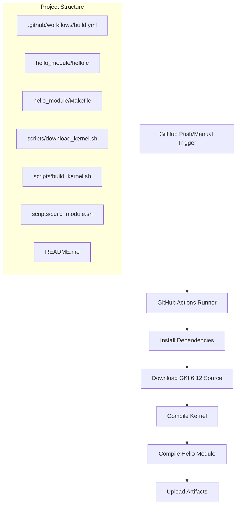

# Design Document: GKI Kernel GitHub Workflow

## Overview

本设计文档描述了一个完整的 GitHub Actions 工作流项目，用于自动化下载 Google GKI 6.12-android16 内核源码、编译内核以及编译 Hello World 内核模块。该项目将创建一个独立的本地仓库，用户推送到 GitHub 后即可自动触发编译流程。

## Architecture



## Components and Interfaces

### 1. GitHub Actions Workflow (build.yml)

工作流配置文件，定义整个 CI/CD 流程。

```yaml
# 触发条件
on:
  push:
    branches: [main, master]
  workflow_dispatch:

# 运行环境
runs-on: ubuntu-latest

# 步骤
steps:
  - checkout
  - install dependencies
  - download kernel source
  - build kernel
  - build module
  - upload artifacts
```

### 2. Hello World Kernel Module

简单的内核模块，用于验证编译流程。

```c
// hello.c 接口
module_init(hello_init)  // 模块加载入口
module_exit(hello_exit)  // 模块卸载入口
```

### 3. Scripts Interface

```bash
# download_kernel.sh
# 输入: 无
# 输出: kernel source in ./kernel-source/
# 返回: 0 成功, 非0 失败

# build_kernel.sh
# 输入: kernel source path
# 输出: Image file
# 返回: 0 成功, 非0 失败

# build_module.sh
# 输入: kernel source path, module source path
# 输出: hello.ko file
# 返回: 0 成功, 非0 失败
```

## Data Models

### 项目目录结构

```
gki-kernel-workflow/
├── .github/
│   └── workflows/
│       └── build.yml           # GitHub Actions 工作流
├── hello_module/
│   ├── hello.c                 # Hello World 模块源码
│   └── Makefile                # 模块编译 Makefile
├── scripts/
│   ├── download_kernel.sh      # 内核源码下载脚本
│   ├── build_kernel.sh         # 内核编译脚本
│   └── build_module.sh         # 模块编译脚本
└── README.md                   # 项目说明文档
```

### 编译产物

```
artifacts/
├── Image                       # 编译后的内核镜像
├── hello.ko                    # 编译后的内核模块
└── Module.symvers              # 模块符号表
```

## Correctness Properties

*A property is a characteristic or behavior that should hold true across all valid executions of a system-essentially, a formal statement about what the system should do. Properties serve as the bridge between human-readable specifications and machine-verifiable correctness guarantees.*

由于本项目主要是配置文件和脚本，大部分验证需要在实际 GitHub Actions 环境中运行。以下是可验证的属性：

**Property 1: 项目结构完整性**
*For any* valid project setup, all required directories and files SHALL exist in the correct locations.
**Validates: Requirements 1.1, 1.2, 1.3, 1.4**

**Property 2: 模块源码完整性**
*For any* valid Hello World module, the source code SHALL contain module_init, module_exit, MODULE_LICENSE, MODULE_AUTHOR, and MODULE_DESCRIPTION macros.
**Validates: Requirements 2.1, 2.5**

**Property 3: 工作流配置完整性**
*For any* valid workflow configuration, it SHALL contain push trigger, workflow_dispatch trigger, ubuntu-latest runner, and all required build steps.
**Validates: Requirements 6.1, 6.2, 6.3, 6.4, 6.5, 6.6, 6.7, 6.8**

## Error Handling

### 脚本错误处理

1. **下载失败**: 脚本使用 `set -e` 确保任何命令失败立即退出
2. **编译失败**: 检查 make 返回值，非零则报错退出
3. **依赖缺失**: 工作流在开始时安装所有依赖

### 工作流错误处理

1. GitHub Actions 默认在任何步骤失败时停止执行
2. 使用 `continue-on-error: false` 确保严格错误处理
3. 日志输出便于调试

## Testing Strategy

### 静态验证

1. **YAML 语法检查**: 验证 workflow 文件语法正确
2. **Shell 脚本检查**: 使用 shellcheck 验证脚本
3. **C 代码检查**: 验证模块源码语法

### 集成测试

1. **GitHub Actions 测试**: 推送代码后观察工作流执行
2. **产物验证**: 检查是否生成 Image 和 hello.ko 文件

### 手动验证

1. **模块加载测试**: 在实际设备上加载 hello.ko 验证功能
